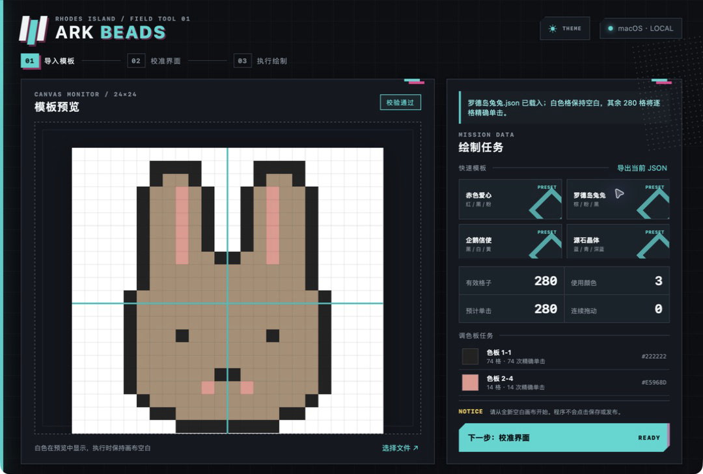

# Ark Beads

一个用于《明日方舟》拼豆小游戏的离线桌面自动化工具。导入 24×24 模板、完成两点校准后，Ark Beads 会自动选择颜色并逐格绘制。

项目灵感与初版模板格式来自[这位哔哩哔哩作者](https://space.bilibili.com/500042199)制作的 [PRTS 像素画取色工具](https://prts.chongxi.us/)，感谢作者提供实用的模板生成网站。



## 当前功能

- 兼容 [PRTS 像素画取色工具](https://prts.chongxi.us/) 导出的 24×24 JSON
- 本地导入图片并转换为官方 40 色、24×24 像素画，不上传原图
- 提供均衡、清晰轮廓、平滑过渡和细节抖动四套转换方案
- 内置 24×24 像素精修工作台，支持官方 40 色画笔、吸色、撤销和重做
- 内置兔子、爱心、企鹅和源石等测试模板
- 支持模板预览、导入、导出和本机模板库
- 只需采集画布左上格与右下格中心，自动推算 24×24 网格和调色板位置
- 按调色板顺序切换颜色，逐格精确点击，避免连笔覆盖其他颜色
- 自动滚动上下半色盘
- 支持暂停、停止和屏幕左上角紧急停止
- 深色与浅色界面

目前已在官方 macOS 客户端中完成实际绘制测试。Windows 版本仍待适配验证。

## 使用方法

开始前请保持游戏窗口为官方固定尺寸，并在游戏中准备一张全新的白色画布。白色会显示在软件预览中，但不会被点击绘制。

1. 打开游戏拼豆界面和 Ark Beads。
2. 选择内置模板、导入网站导出的 24×24 JSON，或点击“图片转模板”在本机生成新模板。
3. 进入“校准界面”，按提示依次采集画布左上格和右下格的中心。
4. 首次使用时，允许 Ark Beads 获得 macOS“辅助功能”权限。
5. 建议先执行一次单格试点，确认画布和色盘定位正确，然后在游戏中撤销试点。
6. 点击开始绘制。工具会自动隐藏，并在倒计时结束后操作游戏。

绘制期间不要移动游戏窗口或手动操作鼠标。需要立即停止时，将鼠标移动到屏幕左上角。Ark Beads 只负责绘制，不会点击游戏内的保存或发布按钮。

游戏窗口位置没有变化时，校准数据可以重复使用；移动窗口或更换显示环境后请重新校准。

### 图片转模板

导入 PNG、JPEG、WebP 等常见图片后，可以在生成前实时调整：

- 转换方案：均衡、清晰轮廓、平滑过渡或细节抖动
- 缩放采样：区域均值、最近邻或双线性
- 画面适配：完整显示、居中裁切或拉伸填满
- 轮廓增强、对比度、饱和度与误差扩散

满意后可将结果加入本机模板库，或直接保存为与网站兼容的 JSON。复杂照片压缩到 24×24 后必然会损失细节，建议优先选择主体明确、轮廓清晰、背景简单的图片，并在四套方案间对比预览。

### 像素精修

已导入的 JSON、内置模板和图片转换结果都可以进入“像素精修”。在 24×24 画布中单击或按住拖动即可上色，也可以使用吸色工具从现有格子取色；修改过程支持撤销、重做和恢复原始版本。精修结果可直接加入本机模板库或另存为 JSON。

## macOS 权限

自动点击依赖系统的辅助功能权限：

1. 打开“系统设置 → 隐私与安全性 → 辅助功能”。
2. 找到并启用 Ark Beads。
3. 如果应用已经启用但仍提示无权限，请完全退出 Ark Beads 后重新打开。

本地开发版建议使用下方的 `pnpm build:mac` 构建。该命令会为应用附加稳定的本地签名要求，减少重新构建后 macOS 重复识别权限的问题。

## 模板格式

当前直接使用 PRTS 工具导出的数据，例如：

```json
{
  "size": 24,
  "cells": [
    {
      "x": 0,
      "y": 0,
      "seq": 1,
      "region": 1,
      "hex": "#FFFFFF",
      "palPos": "第1行第4列"
    }
  ]
}
```

应用会校验画布尺寸、坐标、颜色值和官方色盘位置。不符合要求的模板不会进入绘制流程。

## 本地开发

需要 Node.js、pnpm、Rust 和 macOS Command Line Tools。

```bash
pnpm install
pnpm tauri dev
```

检查项目：

```bash
pnpm check
pnpm build
cd src-tauri && cargo test
```

生成本机 macOS 应用：

```bash
pnpm build:mac
```

应用基于 Rust、Tauri、原生 TypeScript/CSS 和 Enigo 构建。当前版本不引入 OpenCV，以保持安装包和依赖尽可能精简。

## 下载与发布

GitHub Release 提供免安装版本：

- Windows x64：下载 `windows-x64-portable.zip`，解压后直接运行其中的 `ark-beads.exe`
- macOS：下载 `macOS-universal-portable.zip`，解压后将 `Ark Beads.app` 放入“应用程序”再打开；同一文件同时支持 Apple Silicon 和 Intel Mac

目前的自动构建产物未使用商业代码签名证书。Windows 可能显示 SmartScreen 提示；macOS 首次打开时可能需要在“隐私与安全性”中手动允许。鼠标控制仍需单独授予辅助功能权限。

维护者发布新版本时，需要先同步修改 `package.json`、`src-tauri/tauri.conf.json` 和 `src-tauri/Cargo.toml` 中的版本号，然后推送对应标签：

```bash
git tag v0.1.1
git push origin v0.1.1
```

标签会触发 GitHub Actions，自动编译、重命名和压缩 Windows/macOS 产物，并创建对应的 GitHub Release。Windows Release 还会附带一个可选的 `setup.exe` 安装版本。

## 声明与免责

- Ark Beads 是非官方、非商业的开源同人项目，与《明日方舟》及其开发商、发行商不存在隶属、授权、认可或合作关系。
- 《明日方舟》名称、标识、游戏画面及相关素材的商标与著作权归其各自权利人所有。本仓库的 MIT License 仅适用于 Ark Beads 自身源代码，不授予任何第三方游戏素材或商标的使用权。
- 本工具会模拟鼠标输入。使用者应自行确认其使用方式符合游戏用户协议、平台规则及所在地法律法规，并自行承担账号限制、操作失误、数据丢失或其他后果的风险。
- 本软件按“现状”提供，不附带任何明示或默示保证。作者及贡献者不保证软件始终可用、准确、安全或适用于特定目的，也不对因使用或无法使用本软件造成的任何直接或间接损失承担责任。

## License

Copyright © 2026 DuRuofu。本项目源代码基于 [MIT License](LICENSE) 开放使用。
